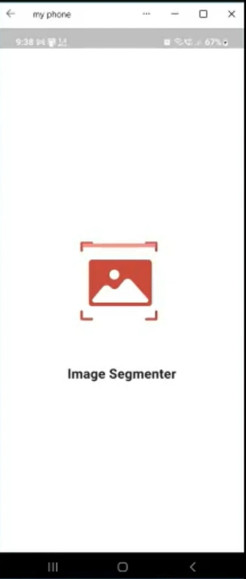
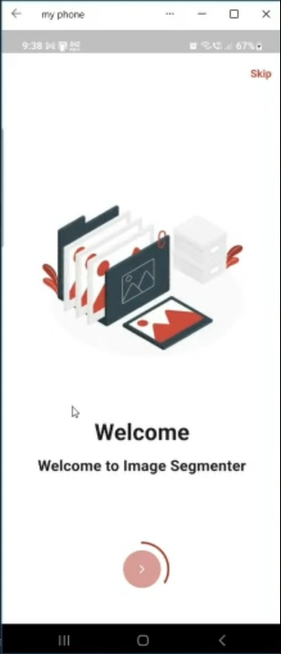
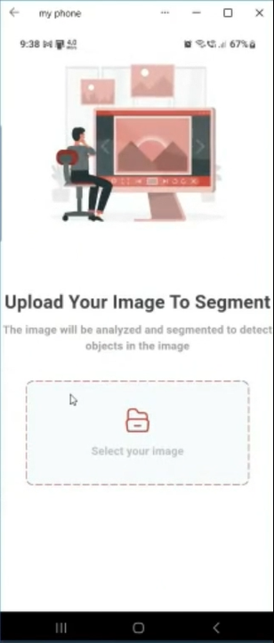
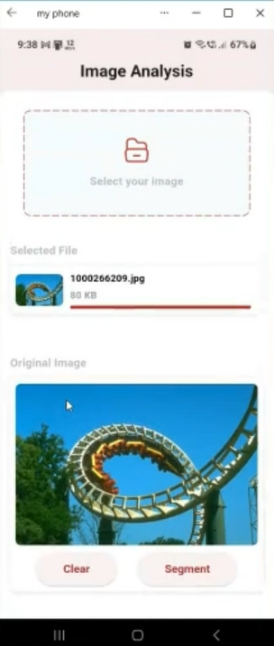
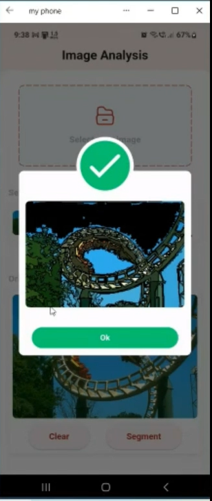
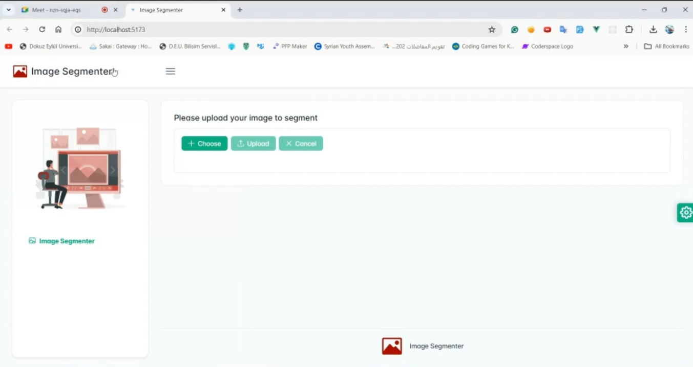
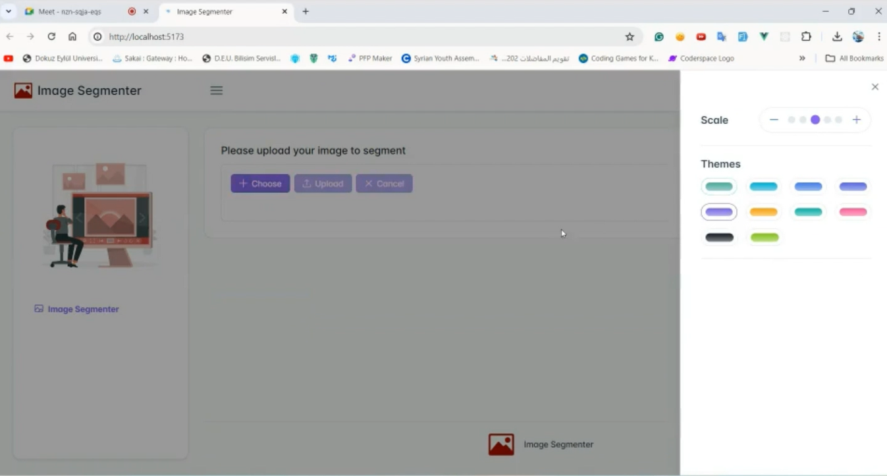
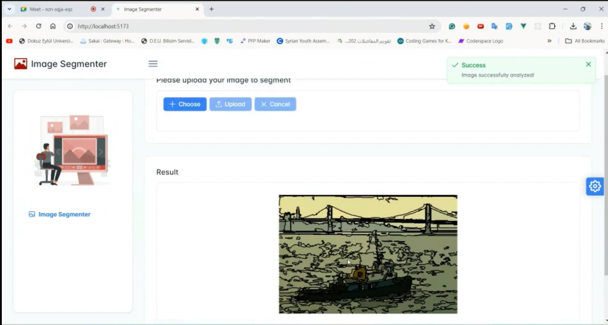

# Image Segmentation Project

This project implements a graph-based image segmentation system, allowing users to upload images and receive segmented results. It consists of three main components: a Flask API for image segmentation, a Flutter mobile app for image upload and display, and a Vue.js web interface for the same purpose.

## Features

- Users can upload images via the Flutter mobile app or Vue.js web interface.
- The uploaded images are sent to the Flask API for segmentation.
- The segmented images are displayed back to the user in the mobile app or web interface.
- The project includes error handling and feedback mechanisms for a smooth user experience.

## Components

### Flask API

The Flask API provides endpoints for image segmentation. It uses scikit-image for graph-based segmentation algorithms.

### Flutter Mobile App

The Flutter mobile app allows users to select images from their device and upload them for segmentation. It communicates with the Flask API to perform image segmentation and displays the segmented results.

### Vue.js Web Interface

The Vue.js web interface offers similar functionality to the mobile app, allowing users to upload images through a web browser and receive segmented results.

## Installation

### Flask API

1. Clone the repository.
2. Navigate to the `API` directory.
3. Install the required Python packages using `pip install`.
4. Run the Flask API.

### Flutter Mobile App

1. Clone the repository.
2. Navigate to the `image_segmenter` directory.
3. Ensure Flutter is installed on your system.
4. Run the app using `flutter run`.

### Vue.js Web Interface

1. Clone the repository.
2. Navigate to the `Front-end` directory.
3. Install dependencies using `npm install`.
4. Run the development server using `npm run serve`.

## Usage

1. Access the Flutter mobile app or Vue.js web interface.
2. Upload an image for segmentation.
3. View the segmented result.

## Demo

## Algorithm Explanation

For the graph-based image segmentation algorithm used in this project, please refer to the following video: [Graph-Based Image Segmentation Algorithm Explanation](https://www.youtube.com/watch?v=2IVAznQwdS4)
